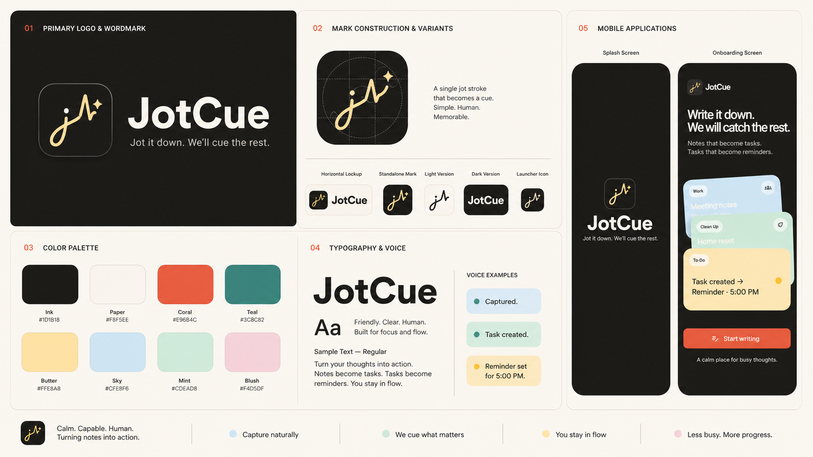
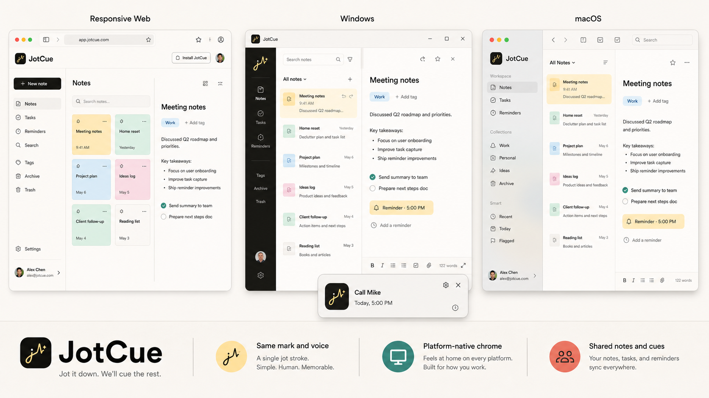

# JotCue Brand Guide

Status: visual direction v1. Production logo geometry and application assets should be finalized only after this direction is approved.

## Brand core

**Name:** JotCue  
**Primary tagline:** Jot it down. We'll cue the rest.  
**Product promise:** Natural notes become clear next actions at the right time.  
**Positioning:** A calm notes workspace that helps people capture thoughts, recognize tasks, and set reminders without breaking their flow.

JotCue should feel:

- Calm, never sleepy.
- Clever, never showy.
- Capable, never complicated.
- Human, never robotic.
- Timely, never demanding.

## Logo idea: the jot stroke

The JotCue mark is one continuous handwritten stroke. It begins as a quick lowercase `j`, rises into one restrained cue beat, and ends in a small signal spark.

The mark represents the product sequence:

1. A thought is captured.
2. JotCue recognizes what matters.
3. A task or reminder is cued.

The shape must remain legible at 24 px. Use flat geometry with rounded line endings. Do not add a page outline, clock, bell, brain, robot, gradient, or multiple decorative sparkles.

### Logo forms

- Primary: ink tile, butter jot stroke, warm signal spark.
- Reversed: paper tile, ink jot stroke.
- Horizontal lockup: mark followed by `JotCue`.
- Wordmark casing is always `JotCue`, never `Jotcue`, `JOTCUE`, or `Jot Cue`.
- The standalone mark may be used for the launcher, favicon, avatar, and compact navigation.

Maintain clear space around the mark equal to the diameter of its terminal signal dot. Never place the mark directly on a note-card pastel without a containing tile.

## Color system

The identity retains the product's existing colors so the rename feels like an evolution.

| Token | Hex | Role |
| --- | --- | --- |
| Ink | `#1D1B18` | Dark canvas, primary text, logo tile |
| Paper | `#F8F5EE` | Light canvas and reversed text |
| Coral | `#E96B4C` | Primary action and active state |
| Teal | `#3C8C82` | Supporting action and confirmation |
| Butter | `#FFE8A8` | Jot stroke, reminder card, warm emphasis |
| Sky | `#CFE8F6` | Work and information notes |
| Mint | `#CDEAD8` | Tasks, completion, calm confirmation |
| Blush | `#F4D5DF` | Personal notes and soft secondary surfaces |

Use Ink text on Coral buttons. Paper text on Coral does not provide enough contrast for normal-sized interface text. Use Ink on all pastel note cards.

Recommended balance:

- 60% Paper or Ink canvas.
- 25% neutral surfaces.
- 10% note-card pastels.
- 5% Coral or Teal signals and actions.

## Typography

**Primary family:** Manrope  
**Fallback:** system sans serif

Manrope gives the identity a friendly geometric shape without becoming childish. Bundle the selected font files with the app so typography does not depend on a network request.

- Display: ExtraBold, tight tracking, compact line height.
- Titles and buttons: Bold.
- Body: Regular or Medium, generous line height.
- Metadata and chips: Medium; avoid all caps.

Headlines should be short enough to read in one breath. Prefer sentence case throughout the product.

## Graphic language

- Use rounded cards and chips from the existing product UI.
- Let cards overlap when showing a thought becoming structured action.
- A single dotted or solid cue path may connect a note, task, and reminder.
- Use one transformation per composition; avoid decorative diagrams.
- Icons use rounded ends and a consistent two-pixel visual stroke.
- Shadows are soft and functional, used only to clarify card depth.

## Motion

The signature motion is `jot -> recognize -> cue`:

1. The jot stroke draws quickly.
2. It pauses for a beat at the recognition point.
3. The terminal dot or spark pulses once.
4. The resulting task or reminder chip settles into place.

Keep brand motion between 350 and 650 ms. Never delay access to app content for an animation.

## Voice

JotCue speaks in short, reassuring confirmations. It explains outcomes rather than technology.

Use:

- Captured.
- Task created.
- Reminder set for 5:00 PM.
- You're all caught up.
- Write naturally. JotCue handles the structure.

Avoid:

- AI-powered productivity revolution.
- We analyzed your content.
- Your request has been processed successfully.
- Urgent or guilt-driven language.

## Product applications

### Splash

- Ink background in dark mode; Paper background in light mode.
- Center the standalone mark at native splash size.
- The Flutter transition may draw the jot stroke and pulse the terminal spark once.
- Do not repeat the full onboarding animation during every launch.

### Onboarding

Preserve the current screen's dark canvas, headline, subtitle, three overlapping pastel notes, Coral action, and closing line.

Rename the header to JotCue and evolve the front note to demonstrate:

`Call Mike at 5pm -> Task created -> Reminder at 5:00 PM`

Primary action: `Start writing`  
Secondary action: `I already have an account`

### Web, Windows, and macOS

All versions share the JotCue mark, wordmark, color roles, typography, note-card language, reminder chips, and concise product voice. Window chrome, navigation density, and system integrations remain native to each platform.

#### Responsive web

- Use the Paper canvas and a compact JotCue product header.
- At desktop widths, use the existing sidebar, note list or grid, and editor layout.
- Collapse navigation progressively at tablet and mobile breakpoints; do not shrink a desktop window into a narrow viewport.
- Keep browser navigation and scroll behavior conventional.
- Offer PWA installation as a quiet secondary action after the user understands the product.
- During Flutter bootstrap, show the standalone mark on the current theme canvas. Do not add an artificial timed splash.
- Use the JotCue mark for favicon and PWA icons, and use `JotCue` consistently in metadata and install prompts.

#### Windows

- Keep standard minimize, maximize, and close controls.
- Use the Ink navigation rail for a focused desktop workspace, with the standalone mark at the top.
- Use moderate information density and visible keyboard focus states.
- Reminder notifications use the JotCue mark, a short title, and one clear time; actions should match Windows notification conventions.
- Respect Windows light, dark, contrast, text-scale, and reduced-motion preferences.
- Display name and packaged executable are `JotCue` and `JotCue.exe`.

#### macOS

- Preserve the traffic-light window controls, application menu, and native title-bar behavior.
- A lightly translucent sidebar is acceptable only when text contrast remains strong.
- Use compact native-feeling toolbar actions and standard macOS shortcuts.
- Keep the note list and editor visually quiet, using separators and whitespace before card-like containers.
- Reminder notifications use the standalone mark and native notification actions.
- Display name, menu labels, and the packaged app bundle use `JotCue`; the bundle identifier remains unchanged.

#### Shared wide-screen workspace

- Left: navigation and account context.
- Middle: searchable note list or responsive card grid.
- Right: focused editor with task and reminder transformations in context.
- Maintain a readable editor measure rather than stretching body text across the full window.
- Use the cue transformation sparingly: one active task or reminder emphasis per view.

Cross-platform principle: **one identity, native behavior**.

### Store listing

**Short promise:** Notes that know what comes next.  
**Long promise:** Jot naturally. JotCue turns the important parts into tasks and timely reminders, without pulling you out of your flow.

## Naming safety

An initial web search found no obvious exact-name productivity product collision for `JotCue`. This is not trademark clearance. Complete professional trademark, company-name, domain, and app-store searches before publishing the renamed app.
